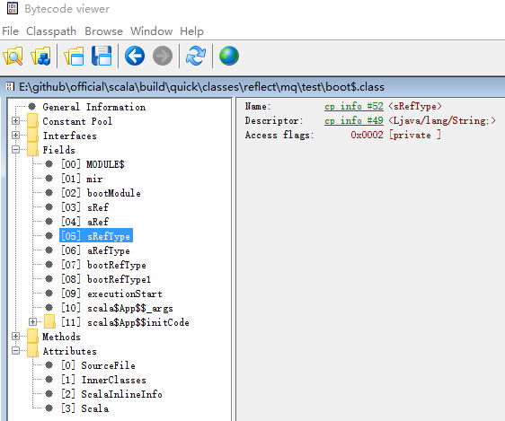



### Type Hierarchy

```                                                                                                                                                                        
                                          Type            
                                            |                                                                                                
                                            |                                                                                           
        -------------------------------------------------------------------------------------------------------------------------------------------
        |            |               |             |         |           |             |                |            |           |                | 
        |            |               |             |         |           |             |                |            |           |                | 
    (NoType)    SingletonType   ExistentialType TypeRef  CompoundType MethodType NullaryMethodType   PolyType   AnnotatedType  TypeBounds BoundedWildcardType
    (NoPrefix)       |                                       |                         
    (WildcardType)   |                                       |                           
        ---------------------------------------           ------------------                         
        |            |          |             |           |                 |                        
        |            |          |             |           |                 |                        
     ThisType   SingleType   SuperType   ConstantType  RefinedType    ClassInfoType                  
```
                                                                                                                             
*  `NoType`, `NoPrefix`, `WildcardType`，是*object*类型，用来描述特殊场景语义点。例如我们调用`TypeApi`中的`def companion: Type`方法，如果没有伴生对象返回值尾`NoType`。
`NoPrefix`描述*path dependent type*中前缀为空的情况，例如`x.type`会编译成`SingleType(NoPrefix, <x>)`, 其中`<x>`代表x的`Symbol`描述。`WildcardType`表示需要类型推断出实际类型。


### Dive into

*  **SingletonType**家族，引用scala reference:
  
>      3.2.1 Singleton Types
>   
>       Syntax:
>       SimpleType ::= Path ‘.’ type
>       
>       A singleton type is of the form p.type,where p is a path pointing to a value expected
>       to conform (§6.1) to scala.AnyRef. The type denotes the set of values consisting of
>       null and the value denoted by p.
>       A stable type is either a singleton type or a type which is declared to be a subtype of
>       trait scala.Singleton.
  
  上述*Path*必须指向`AnyRef`（对于此，以后可能会更改把primitive numeric字面类型也加进来，参考[SIP-23](http://docs.scala-lang.org/sips/pending/42.type.html)），`type`要么是`singleton type`要么是`scala.Singleton`子类。
  
>     EBNF:
>
>      Path ::= StableId | [id '.'] 'this'
>      StableId ::= id | Path '.' id | [id '.'] 'super' [ClassQualifier] '.' id
>      ClassQualifier ::= '[' id ']'
>      id ::= plainid | '`' stringLiteral '`'
>      plainid ::= upper idrest | varid | op
    
  我们看到stableId与id是包含关系，多出来了*this*和*super[...]*。有点晕，来看下demo:
  
```scala
  1    package mq.test
  2    
  3    object boot extends App {
  4    
  5      import scala.reflect.runtime.universe
  6      import scala.reflect.runtime.universe._
  7   
  8      val mir = universe.runtimeMirror(getClass.getClassLoader)
  9      val bootModule = mir.staticModule("mq.test.boot")
  10    
  11    
  12      val sRef = "mqiano"
  13      val aRef = Array(1,2,3)
  14    
  15      var sRefType: sRef.type = sRef
  16      var aRefType : aRef.type = aRef
  17    
  18      var bootRefType: boot.this.type = boot
  19      var bootRefType1: boot.type = boot
  20      
  21      //sRefType = "mqiano" //will cause compile error!
  22    
  23      //print out
  24      println(bootModule.info.member(TermName("sRef")).info.resultType.getClass)        //class scala.reflect.internal.Types$ClassNoArgsTypeRef
  25      println(bootModule.info.member(TermName("aRef")).info.resultType.getClass)        //class scala.reflect.internal.Types$ClassArgsTypeRef
  26      println(bootModule.info.member(TermName("sRefRes")).info.resultType.getClass)     //class scala.reflect.internal.Types$UniqueSingleType
  27      println(bootModule.info.member(TermName("aRefRes")).info.resultType.getClass)     //class scala.reflect.internal.Types$UniqueSingleType
  28      println(bootModule.info.member(TermName("bootRefRes")).info.resultType.getClass)  //class scala.reflect.internal.Types$UniqueThisType
  29      println(bootModule.info.member(TermName("bootRefRes1")).info.resultType.getClass) //class scala.reflect.internal.Types$UniqueSingleType
  30    }
```
  
  那么编译之后的class文件如何呢：
   
  
  可以看到xxxType的变量类型都是普通的java类型，意味着在runtime时，jvm允许21行的执行。上述*singleton type*的类型在编译期间是有对应的效果的，会被compile理解成不同的类型，typecheck会校验类型匹配。
  嗯，如果存在另外一个类（在另外一个文件里）去执行21行，编译时期会发生什么？当然是不通过。原因在于，虽然在class文件中，Fields段是java specification规范定义，scala无法更改，但是在Attributes段，是可以自定义的。
  看到了ScalaInlineInfo和scala吗，这些字段的scala类型信息保存在scalaInlineInfo中，对于`boot$.class`里，长度是119。
  
  另外，对于只有
  
  参考：[jvm specification class file format](http://docs.oracle.com/javase/specs/jvms/se7/html/jvms-4.html), [pickled scala signatures](http://www.scala-lang.org/old/sites/default/files/sids/dubochet/Mon,%202010-05-31,%2015:25/Storage%20of%20pickled%20Scala%20signatures%20in%20class%20files.pdf),

*  `TypeRef`, 引用某一类型，使用频率最高：

```scala

    trait TypeRefApi extends TypeApi { this: TypeRef =>
      /** The prefix of the type reference.
       *  Is equal to `NoPrefix` if the prefix is not applicable.
       */
      def pre: Type
      /** The underlying symbol of the type reference. */
      def sym: Symbol
      /** The arguments of the type reference.
       *  Is equal to `Nil` if the arguments are not provided.
       */
      def args: List[Type]
    }  
    
    //for example
    
    T # C[T_1, ..., T_n]      TypeRef(T, C, List(T_1, ..., T_n))
    p.C[T_1, ..., T_n]        TypeRef(p.type, C, List(T_1, ..., T_n))
    C[T_1, ..., T_n]          TypeRef(NoPrefix, C, List(T_1, ..., T_n))
    T # C                     TypeRef(T, C, Nil)
    p.C                       TypeRef(p.type, C, Nil)
    C                         TypeRef(NoPrefix, C, Nil)
    
```

* `CompoundType`，组合类型：

EBNF:

>      CompoundType ::= AnnotType { 'with' AnnotType} [Refinement] | Refinement
>      Refinement   ::= [nl] '{' RefineStat { semi RefineStat} '}'
>      RefineStat   ::= Dcl | 'type' TypeDef |

举例 ：`def takeoff(runway: Int, r: A with B { val callsign: String; def fly(height: Int) }) = ???`。

在reflect中还包括了class/trait定义（classInfoType）。我来看下Api接口定义：

```scala
      trait RefinedTypeApi extends TypeApi { this: RefinedType =>
        /** The superclasses of the type. */
        def parents: List[Type]
    
        /** The scope that holds the definitions comprising the type. */
        def decls: MemberScope
      }
      
      trait ClassInfoTypeApi extends TypeApi { this: ClassInfoType =>
          /** The superclasses of the class type. */
          def parents: List[Type]
      
          /** The scope that holds the definitions comprising the class type. */
          def decls: MemberScope
      
          /** The symbol underlying the class type. */
          def typeSymbol: Symbol
        }
```

除了`ClassInfoTypeApi`多了个自己的名字（typeSymbol），其它一样。
    
* `MethodType`, `NullaryMethodType`, `PolyType`, 都是描述method, 但是`NullaryXXX`描述不带括号的， `PolyType`描述多态方法。

```scala
    trait MethodTypeApi extends TypeApi { this: MethodType =>
        /** The symbols that correspond to the parameters of the method. */
        def params: List[Symbol]
    
        /** The result type of the method. */
        def resultType: Type
      }
     
    trait NullaryMethodTypeApi extends TypeApi { this: NullaryMethodType =>
        /** The result type of the method. */
        def resultType: Type
      }
        
    trait PolyTypeApi extends TypeApi { this: PolyType =>
        /** The symbols corresponding to the type parameters. */
        def typeParams: List[Symbol]
    
        /** The underlying type. */
        def resultType: Type
      }
```      

demo code:

```scala
    package mq.test
    
    object boot extends App {
    
      import scala.reflect.runtime.universe
      import scala.reflect.runtime.universe._
    
      val mir = universe.runtimeMirror(getClass.getClassLoader)
      val bootModule = mir.staticModule("mq.test.boot")
     
      def normal(x: Int) = 1
      def noArg() = 2
      def nullArg = 2
      def poly[T](t: T) = t
    
      //print out
      println(bootModule.info.member(TermName("normal")).info.getClass)  //class scala.reflect.internal.Types$MethodType  
      println(bootModule.info.member(TermName("noArg")).info.getClass)   //class scala.reflect.internal.Types$MethodType  
      println(bootModule.info.member(TermName("nullArg")).info.getClass) //class scala.reflect.internal.Types$NullaryMethodType   
      println(bootModule.info.member(TermName("poly")).info.getClass)    //class scala.reflect.internal.Types$PolyType 
    }
```

* 存在类型

存在类型对应java里的通配类型（wildcard type）。参考[programming scala](https://www.safaribooksonline.com/library/view/programming-scala/9780596801908/ch12s11.html)

```scala
    package mq.test
    
    object boot extends App {
    
      import scala.reflect.runtime.universe
      import scala.reflect.runtime.universe._
    
      val mir = universe.runtimeMirror(getClass.getClassLoader)
      val bootModule = mir.staticModule("mq.test.boot")
    
    
      val sRef = "mqiano"
    
      def normal(x: (List[T] forSome { type T }) with Int {def xxx: Int}) = ???
    
      //print out：class scala.reflect.internal.Types$ExistentialType
      println(bootModule.info.member(TermName("normal")).info.paramLists.head.head.info.asInstanceOf[RefinedType].parents.head.getClass)
      
```

* AnnotatedType, 针对`<type> @<annotation>`的编译期间描述。 

EBNF: 

    AnnotType ::= SimpleType {Annotation}

数据结构：

```scala
     trait AnnotatedTypeApi extends TypeApi { this: AnnotatedType =>
       /** The annotations. */
       def annotations: List[Annotation]
   
       /** The annotee. */
       def underlying: Type
     }
```

demo:

```
package mq.test

object boot extends App {

  import scala.reflect.runtime.universe
  import scala.reflect.runtime.universe._

  val mir = universe.runtimeMirror(getClass.getClassLoader)
  val bootModule = mir.staticModule("mq.test.boot")


  val sRef = "mqiano"


  def normal(x: (List[T] forSome { type T }) @Deprecated with Int {def xxx: Int} ) = ???

  //print out: class scala.reflect.internal.Types$ExistentialType
  println(bootModule.info.member(TermName("normal")).info.paramLists.head.head.info.asInstanceOf[RefinedType].parents.head.getClass)
  
```

* TypeBounds, 描述类型的上下限。例如:

```
    T >: L <: U TypeBounds(L, U)
    T >: L      TypeBounds(L, Any)
    T <: U      TypeBounds(Any, U)
```    
    
数据结构：

```scala
     trait TypeBoundsApi extends TypeApi { this: TypeBounds =>
       /** The lower bound.
        *  Is equal to `definitions.NothingTpe` if not specified explicitly.
        */
       def lo: Type
   
       /** The upper bound.
        *  Is equal to `definitions.AnyTpe` if not specified explicitly.
        */
       def hi: Type
     } 
```

* BoundedWildcardTypes, 这个和wildcardType类似，在类型推断过程中使用，无论在源码级别或者反射级别都无法触碰，如果你拿到了引用，很可能就发现了bug。
这个还是比较好理解的，推断出的类型有上下限约束性。

#### Note: 我认为对于类型系统较为重要的背景知识[higher](http://adriaanm.github.io/files/higher.pdf), 简单[介绍](http://blogs.atlassian.com/2013/09/scala-types-of-a-higher-kind/)